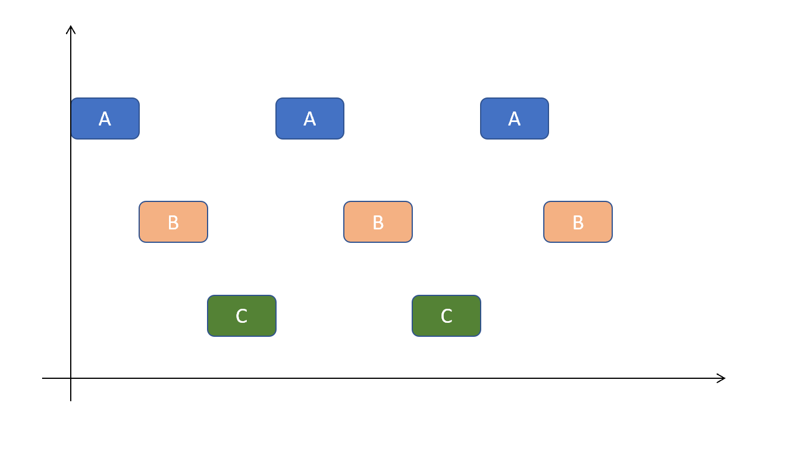
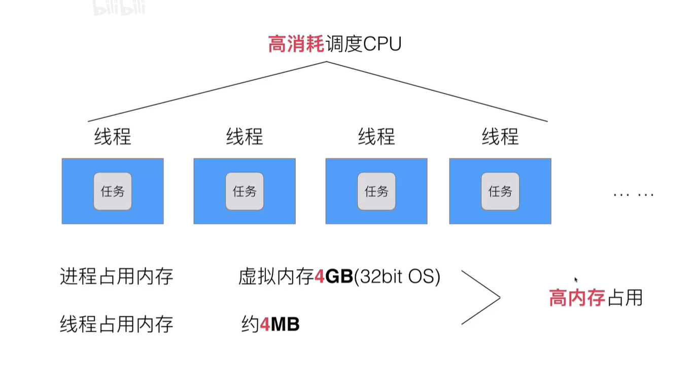
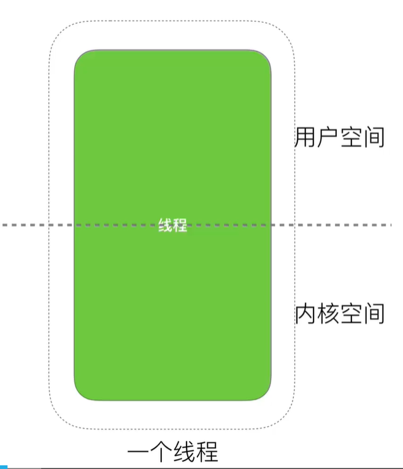
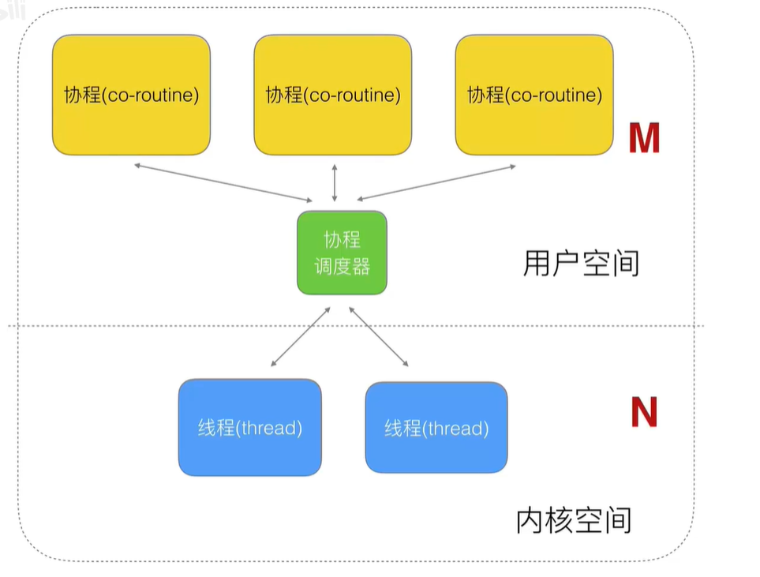
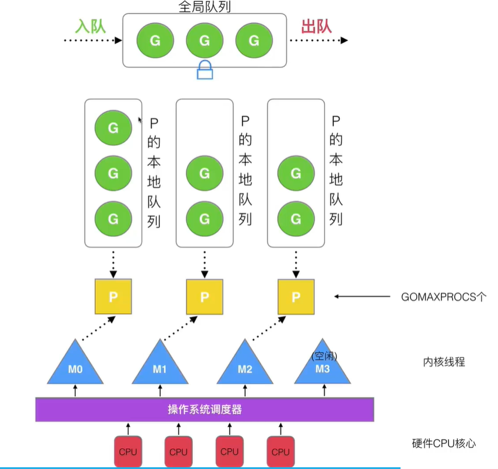

要点：

- 并发与并行概念


# 并发与并行概念

单机时代：CPU只能处理一个计算任务（函数），一些耗时的操作（阻塞），例如磁盘读取、网络延时只能等待。

多进程与多线程：为了让CPU能够执行多个任务，人们就想到：把阻塞的进程保存起来，转而执行一个新的进程。因此，可以设计一个就绪进程队列，CPU空闲的时候就从该队列拿出一个进程执行，如果阻塞就把它加入到阻塞队列中，当阻塞任务完成后，就把它加入到就绪队列中，这样CPU就能不断的执行任务。



从就绪队列取进程的过程称为进程调度。调度有很多种策略，其中一种策略是：把CPU执行时间划分为较小的单元，称为时间片，当时间片用完的时候，就从队列中取一个新的进程执行，把旧的进程放到队列末尾或其他队列中。

现在有一个问题：切换进程（调度）也会消耗 CPU 时间，这种时间开销是固定的，切换频率越高，导致 CPU 整体的效率越低。

人们发现有的任务不需要分配进程所需的全部资源，可以利用现有的“基础设施”，只是有些地方有细微差别而已，这种更轻量的调度单位称为线程（以下图片来自B站@刘丹冰Aceld）。



如果再仔细观察一个线程的执行，就会发现它由两部分组成：




一部分代码是用户代码，一部分是操作系统代码，人们就想，内核空间的代码也是可以重用的，因此就有了如下的任务调度方式，以**协程**为单位进行调度：



Go 语言的协程模型：




M代表内核线程，G代表协程（goroutine），P代表调度器。

Goroutine 调度的基本策略：

- 首先从本地队列获取任务
- 如果本地队列没有就从其他的本地队列中获取
- 如果本地队列都没有任务，就会从全局队列中获取


# Go 协程创建

Go 语言使用 `go` 关键字创建一个协程：

```go
package main

import (
	"fmt"
	"time"
)

func hello() {
	for i := 0; i < 5; i++ {
		fmt.Println("goroutine:", i)
		time.Sleep(1 * time.Second)
	}

}
func main() {
	go hello()

	for i := 0; i < 5; i++ {
		fmt.Println("main:", i)
		time.Sleep(1 * time.Second)
	}
}
```

结果：

```shell
main: 0
goroutine: 0
main: 1
goroutine: 1
main: 2
goroutine: 2
main: 3
goroutine: 3
goroutine: 4
main: 4
```

如果你注释掉 `sleep` ，可能无法打印结果，这是因为主线程会先退出。

当然，使用匿名函数也是一样的效果：

```go
package main

import (
	"fmt"
	"time"
)

func main() {
	go func() {
		for i := 0; i < 5; i++ {
			fmt.Println("goroutine:", i)
			time.Sleep(1 * time.Second)
		}

	}()

	for i := 0; i < 5; i++ {
		fmt.Println("main:", i)
		time.Sleep(1 * time.Second)
	}
}
```

# Channels

Go 协程之间通过 Channels 通信，示例如下：

```go
package main

import (
	"fmt"
)

func hello(c chan int) {
	num := <-c
	fmt.Println("goroutine get:", num)
}

func main() {
	c := make(chan int)
	go hello(c)
	c <- 666
	fmt.Println("main end.")
}
```

结果：

```shell
goroutine get: 666
main end.
```

📝要点解读：

- channel 就像一个管道，一边可以放入数据，另一边可以读取数据，创建管道的方法是 `make(chan int)`，放入管道的方法是：`c <- i`，取数据的方法是：`num := <-c`。需要注意的是：`<-c` 是一个整体，不能有空格。
- 这里没有用 `sleep()` 也能正常打印，这是因为 channel 带有同步机制，channel 会阻塞`main（）` 直到数据被读走。

# 带有缓冲的 Channel

```go
package main

import (
	"fmt"
)

func gen(c chan int) {
	for i := 0; i < 5; i++ {
		c <- i * i
	}
}

func main() {
	c := make(chan int, 3)
	go gen(c)

	for {
		if num, ok := <-c; ok {
			fmt.Printf("Get:%2d, len: %d, cap: %d\n", num, len(c), cap(c))
		} else {
			break
		}
	}
	fmt.Println("Main exit.")
}
```

结果：

```shell
Get: 0, len: 3, cap: 3
Get: 1, len: 3, cap: 3
Get: 4, len: 2, cap: 3
Get: 9, len: 1, cap: 3
Get:16, len: 0, cap: 3
fatal error: all goroutines are asleep - deadlock!
```

虽然我们能把所有数据取出来，但是会报错，这是因为我们放完了数据之后没有关闭 channel，导致主程序在无限循环。

```go
func gen(c chan int) {
	for i := 0; i < 5; i++ {
		c <- i * i
	}
	close(c)
}
```

现在我们能正常运行了：

```shell
Get: 0, len: 3, cap: 3
Get: 1, len: 3, cap: 3
Get: 4, len: 2, cap: 3
Get: 9, len: 1, cap: 3
Get:16, len: 0, cap: 3
Main exit.
```

# range

以上代码可以用 `range` 简化为：

```go
package main

import (
	"fmt"
)

func gen(c chan int) {
	for i := 0; i < 5; i++ {
		c <- i * i
	}
	close(c)
}

func main() {
	c := make(chan int, 3)
	go gen(c)

	for num := range c {
		fmt.Printf("Get:%2d, len: %d, cap: %d\n", num, len(c), cap(c))
	}

	fmt.Println("Main exit.")
}
```

# select

```go
package main

import (
	"fmt"
)

func odd(c chan int) {
	for i := 0; i < 5; i++ {
		c <- i*2 + 1
	}
}

func even(c chan int) {
	for i := 0; i < 5; i++ {
		c <- i * 2
	}
}

func main() {
	c1 := make(chan int)
	c2 := make(chan int)
	go odd(c1)
	go even(c2)
out:
	for {
		select {
		case num1 := <-c1:
			fmt.Println("Get Odd:", num1)
			break out
		case num2 := <-c2:
			fmt.Println("Get even:", num2)
			break out
		default:
			fmt.Println("No number.")
		}
	}
}
```

📝要点解读：

- `select`：用于轮询多个 channel，当该 case 可读或可写（不阻塞）的时候，就会执行该分支，并跳过其他的 case。
- 上述代码的逻辑是：只要读到一个奇数或偶数就退出，不然就一直循环。

