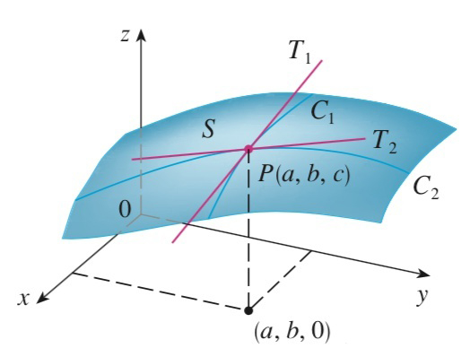

# 方向导数

单变量函数中，函数的图是一个二维平面上的曲线，导数对应了一条直线(切线)。两个变量的函数在一点沿不同方向的变化率不同，这就是所谓的**方向导数**。

【定义】函数 $z=f(x,y)$ 在点 $P(x_0,y_0,z_0)$ 沿 $\vec{e}=\cos\alpha\vec{i}+\cos\beta\vec{j}$ 的方向导数定义为：
$$
\frac{\partial f}{\partial \vec{e}}\Bigg|_{P}=\lim_{t\to0}\frac{f(x_0+t\cos\alpha, y_0+t\cos\beta)-f(x_0,y_0)}{t}
$$
事实上，如果 $\vec{e}=(1,0)$，则 $\frac{\partial f}{\partial \vec{e}}\Bigg|_{P}=\frac{\partial f}{\partial x}\Bigg|_{P}$；如果 $\vec{e}=(0,1)$，则 $\frac{\partial f}{\partial \vec{e}}\Bigg|_{P}=\frac{\partial f}{\partial y}\Bigg|_{P}$。

【定理】如果函数可微，则有：
$$
\frac{\partial f}{\partial \vec{e}}\Bigg|_{P}=f_x(x_0,y_0)\cos\alpha+f_x(x_0,y_0)\cos\beta
$$

# 梯度

既然函数在不同方向的导数不同，自然就有一个问题：函数在哪个方向变化得最快？

【定义】把向量 $f_x(x_0,y_0)\vec{i}+f_y(x_0,y_0)\vec{j}$ 称为函数 $z=f(x,y)$ 在点 $P(x_0,y_0,z_0)$ 处的梯度，记作 $\boldsymbol{grad} f(x_0,y_0)$。

根据以上定义有：
$$
\frac{\partial f}{\partial \vec{e}}\Bigg|_{P}=\boldsymbol{grad} f(x_0,y_0)\cdot\vec{e}
$$
所以 $\vec{e}$ 沿梯度方向时，函数的变化率最大。 

# 几何应用

## 空间曲线的切线

设空间曲线的参数方程为：
$$
x=x(t),y=y(t),z=z(t)
$$
则它切线的方向为 $(x'(t_0),y'(t_0),z'(t_0))$。

## 空间曲面的法线

设曲面 $F(x,y,z)=0$ 可微，则在点 $P_0(x_0,y_0,z_0)$ 处的切面法向量可以表示为：
$$
(F_x,F_y,F_z)\Bigg|_{P_0}
$$
若曲面可以表示为：$z=f(x,y)$，则切平面法向量可以写为：
$$
(f_xf_y,-1)\Bigg|_{P_0}
$$

# 极值

如果函数 $z=f(x,y)$ 在某个邻域 $U(x_0,y_0)$ 内满足：

- 如果 $f(x_0,y_0)\le f(x,y)$，则称 $(x_0,y_0)$ 为极小值点；
- 如果 $f(x_0,y_0)\ge f(x,y)$，则称 $(x_0,y_0)$ 为极大值点；

驻点：使得两个偏导数为零的点称为驻点。

## 取极值的充分条件

设 $z=f(x,y)$ 在点 $P_0(x_0,y_0)$ 的邻域内存在连续的二阶偏导数，且 $f_x(x_0,y_0)=0,f_y(x_0,y_0)=0$，记 $f_{xx}(x_0,y_0)=A,f_{xy}(x_0,y_0)=B,f_{yy}(x_0,y_0)=C$，则有：

1）当 $AC-B^2>0$ 时，$P_0$ 是极值点，且当 $A>0$ 时，是极小值点，当 $A<0$ 时，是极大值点；

2）当 $AC-B^2<0$ 时，$P_0$ 不是极值点；

3）当 $AC-B^2=0$ 时，无法判定 $P_0$ 是不是极值点；

