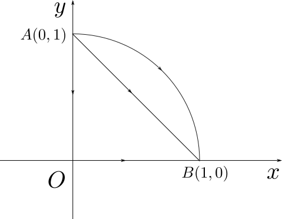

# 曲线积分概念

【问题】设有一平面曲线 $L$，其密度为 $f(x,y)$，试求其质量 $M$。

利用极限的思想解决这个问题的步骤如下：

1. 分割。把曲线分割为若干份，把它的一小段长度记为 $\Delta s_i$；
2. 近似代替。对于一小段曲线 $M_{i-1}M_i$，可以用它上面一个点的密度 $f(\xi_i,\eta_i)$ 代替整个曲线的密度，因此它的质量 $\Delta M_i=f(\xi_i,\eta_i)\Delta s_i$；

3. 求和。整段曲线的质量近似为：$\underset{i}{\sum}\Delta M_i$；
4. 求极限。$M=\underset{\lambda\to0}{\lim} \underset{i}{\sum}\Delta M_i$，其中 $\lambda=\underset{i}{\max} \{\Delta s_i\}$。

如果不论 $L$ 如何分割，也不论 $(\xi_i,\eta_i)$ 如何选取，极限：
$$
M=\lim_{\lambda\to0}\sum_{i}f(\xi_i,\eta_i)\Delta s_i
$$
总存在，则称该极限为 $L$ 的**第一类曲线积分**，记为：
$$
\int_L f(x,y)ds=\lim_{\lambda\to0}\sum_{i}f(\xi_i,\eta_i)\Delta s_i
$$
其中 $ds$ 称为**弧元素**。

# 参数方程下曲线积分的计算

如果曲线可以用参数方程表示为：
$$
\begin{cases}
x=x(t)\\
y=y(t)\\
\end{cases}
\quad t\in[\alpha,\beta]
$$
则：
$$
\int_L f(x,y)ds=\int_{\alpha}^{\beta} f(x(t),y(t))\sqrt{x'(t)^2+y'(t)^2}dt
$$

# 第二类曲线积分

【问题】设质点在变力 $\vec{F}(x,y)=P(x,y)\vec{i}+Q(x,y)\vec{j}$ 的作用下沿曲线 $L$ 从$M_0$ 运动到 $M_n$，求它做的功 $W$。

利用极限的思想解决这个问题的步骤如下：

1. 分割。把曲线分割为若干份，把它的一小段长度记为 $\Delta s_i$；
2. 近似代替。对于一小段曲线 $M_{i-1}M_i$，可以用它上面一个点的力  $\vec{F}(\xi_i,\eta_i)$  代替整个小段曲线的力，并用该点处的切向位移 $\Delta \vec{r}_i=\vec{e}_\tau(\xi_i,\eta_i)\Delta s_i$代替整个小段曲线的位移，计算它的功： $\Delta W_i=\vec{F}(\xi_i,\eta_i)\cdot \vec{e}_\tau(\xi_i,\eta_i)\Delta s_i$；

3. 求和。整段曲线的功近似为：$\underset{i}{\sum}\Delta W_i=\underset{i}{\sum}\vec{F}(\xi_i,\eta_i)\cdot\Delta \vec{r}_i=\underset{i}{\sum}\vec{F}(\xi_i,\eta_i)\cdot\vec{e}_\tau(\xi_i,\eta_i) \Delta s_i$；
4. 求极限。$W=\underset{\lambda\to0}{\lim} \underset{i}{\sum}\Delta W_i$，其中 $\lambda=\underset{i}{\max} \{\Delta s_i\}$。

上述极限右端恰为数值函数 $\vec{F}(x,y)\cdot\vec{e}_\tau(x,y)$ 在曲线 $L$ 上的第一类曲线积分。把积分:
$$
\int_L\vec{F}(x,y)\cdot d\vec{r}=\int_L \vec{F}(x,y)\cdot \vec{e}_{\tau}(x,y) ds
$$
称作 $L$ 的**第二类曲线积分**。其中 $\vec{e}_{\tau}(x,y)$ 为 $L$ 上点 $(x,y)$ 处与有向曲线方向一致的单位切向量。

# 对坐标的曲线积分

把 $\vec{e}_{\tau}(x,y)$ 表示为 $\cos\alpha \vec{i}+\cos\beta \vec{j}$ 的形式，其中 $\alpha,\beta$ 分别为  $\vec{e}_{\tau}(x,y)$ 与 $x$ 轴，$y$ 轴的夹角，它们均是 $x, y$ 的函数。因此：
$$
\int_L \vec{F}(x,y)\cdot \vec{e}_{\tau}(x,y) ds=\int_L \bigg(P(x,y)\cos\alpha+Q(x,y)\cos\beta \bigg)ds
$$
若记：
$$
\int_L P(x,y)dx=\int_L P(x,y)\cos\alpha ds,\quad\int_L Q(x,y)dy=\int_L Q(x,y)\cos\beta ds
$$
则：
$$
\int_L \vec{F}(x,y)\cdot \vec{e}_{\tau}(x,y) ds=\int_L P(x,y)dx+\int_L Q(x,y)dy=:\int_L P(x,y)dx+Q(x,y)dy
$$
从上式可以看出，第二类曲线积分又叫对**坐标的曲线积分**。

# 对坐标曲线积分的计算

设有向曲线 $L$ 的参数方程为：
$$
\begin{cases}
x=x(t)\\
y=y(t)\\
\end{cases}
\quad t\in[\alpha,\beta]
$$
它的起点记为$A:(x(\alpha),y(\alpha))$，终点记为 $B:(x(\beta),y(\beta))$，则：
$$
\int_L P(x,y)dx+Q(x,y)dy=\int_\alpha^\beta\bigg( P(x(t),y(t))x'(t)+Q(x(t),y(t))y'(t) \bigg)dt
$$
【例题】计算：$I=\int_Lx^2dx$，$L$ 图所示：

(1) 线段 $AB$；

(2) 弧线 $AB$ 为圆的一部分；

(3) 折线 $AOB$；

【解】

（1）线段 $AB$ 的方程为：$y=1-x$，因此
$$
I=\int_0^1x^2d(1-x)=-\int_0^1x^2dx=-\frac{1}{3}
$$
(2) 弧线 $AB$ 的参数方程为：
$$
\begin{cases}
x=x(t)\\
y=y(t)\\
\end{cases}
\quad t\in[\frac{\pi}{2},0]
$$
因此：
$$
I=\int_{\frac{\pi}{2}}^0\cos^2td(\sin t)=\int_{\frac{\pi}{2}}^0(1-\sin^2t)d(\sin t)=\sin t-\frac{1}{3}\sin^3t\Bigg|_\frac{\pi}{2}^0=-\frac{2}{3}
$$
(3) 
$$
I=\int_{\over{AO}}x^2dy+\int_{\over{OB}}x^2dy=\int_1^00dy+\int_0^1x^2d0=0
$$

# 格林公式

设平面闭区域 $D$ 的边界 $\partial D$ 为分段光滑曲线，当观察者沿着边界运动时，区域在他的左手边，则把此方向定义为正方向。$P(x,y),Q(x,y)$ 在 $D$ 都有连续偏导数，则：
$$
\oint_{\partial D}Pdx+Qdy=\iint_D\bigg(\frac{\partial Q}{\partial x}-\frac{\partial P}{\partial y}\bigg)dxdy
$$
【例题】计算 $\oint_Lxdy-ydx$，其中 $L$ 是以 $O(0,0),A(0,1),B(1,0)$ 为顶点的的三角形边界取逆时针方向。

【解】
$$
\oint_Lxdy-ydx=\iint_D(1+1)dxdy=2\cdot\frac{1}{2}=1
$$

# 平面曲线积分与路径无关的条件

如下命题等价：

1. 对 $D$ 内任意闭曲线 $L$ ，有 $\oint_L Pdx+Qdy=0$；
2. 对 $D$ 内任意曲线 $AB$，$\oint_{AB} Pdx+Qdy$ 仅与起点 $A$ 与终点 $B$ 有关，与曲线形状无关；
3. $D$ 内存在可微函数 $u$ 使得 $du=Pdx+Qdy$；
4. $\frac{\partial Q}{\partial x}=\frac{\partial P}{\partial y}$ 在 $D$ 内处处成立。

