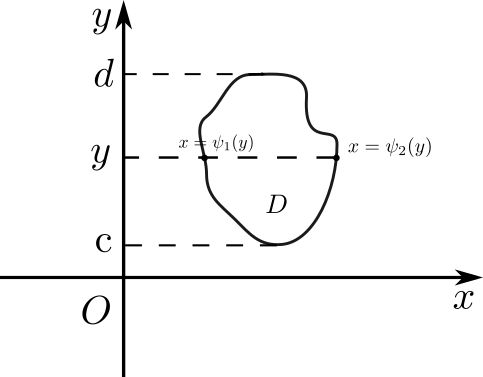
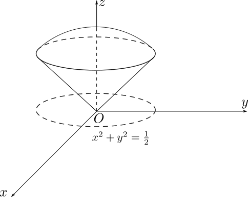

# 重积分概念

设 $f(x,y)$ 是有界闭区域 $D\subseteq \mathbb{R}^2$ 上的有界函数，将区域 $D$ 划分为 $n$ 个小区域 $\Delta \sigma_i$，其面积也记为 $\Delta \sigma_i$，在每个小区域内任取一点 $(\xi_i, \eta_i)$，记 $\lambda=\max\{\Delta \sigma_i\}$，若极限 $\underset{\lambda \to 0}{\lim} \underset{i}{\sum} f(\xi_i, \eta_i)\Delta \sigma_i$ 存在，则称函数 $f(x,y)$ 在 $D$ 上可积，此极限称为函数 $f(x,y)$ 在 $D$ 上的**二重积分**，记为：
$$
\iint_Df(x,y)d\sigma = \lim_{\lambda \to 0}\sum_{i=1}^{n} f(\xi_i,\eta_i)\Delta \sigma_i
$$
其中 $f(x,y)$ 叫被积函数，$f(x,y)d\sigma$ 叫积分表达式，$D$ 叫积分区域，$d\sigma$ 叫面积元素，$x,y$ 叫积分变量。

类似可以定义**三重积分**：
$$
\iiint_\Omega f(x,y,z)dV = \lim_{\lambda \to 0}\sum_{i=1}^{n} f(\xi_i,\eta_i,\zeta_i)\Delta v_i
$$
$\Omega$ 叫积分区域，$dV$ 叫体积元素。

# 直角坐标系下二重积分的计算

直角坐标系下面积元素满足：$d\sigma=dxdy$，于是：
$$
\iint_Df(x,y)d\sigma =\iint_Df(x,y)dxdy
$$

求积分的步骤：

1. 把区域 $D$ 用不等式组表示

$$
D=\{(x,y)\big| \psi_1(y)\le x\le\psi_2(x), c\le y\le d  \}
$$

2. 固定 $y$，求曲边梯形的面积 $A(y)=\int_{\psi_1(y)}^{\psi_2(y)} f(x,y)dx$；

3. 求体积 $V=\int_c^dA(y)dy$，因此：

$$
\iint_Df(x,y)dxdy=\int_c^d\left( \int_{\psi_1(y)}^{\psi_2(y)}f(x,y)dx \right)dy
$$

提示：先固定 $x$ 与先固定 $y$ 求解的结果是一样的。

【例题】求二重积分 $\iint_Dxydxdy$，其中 $D$ 是由曲线 $y=x+2,y=x^2, x=2$ 围成的区域。

【解】本题可以采用先固定 $x$ 的方法求。
$$
\begin{align}
\iint_Dxydxdy
&=\int_1^2\left(\int_{2-x}^{x^2}xydy \right)dx\\
&=\int_1^2 x\left(\frac{y^2}{2}\bigg|_{2-x}^{x^2}\right)dx\\
&=\int_1^2 x(\frac{x^4-(2-x)^2}{2})dx\\
&=\frac{121}{24}
\end{align}
$$

# 极坐标系下二重积分的计算

在极坐标系下面积元素为 $d\sigma=\rho d\rho d\theta$

【例题】计算$\iint _D e^{-(x^2+y^2)}d\sigma$，其中 $D=\{(x,y)\big|x^2+y^2\le a^2\}$.

【解】转化为极坐标之后积分限变为：$0\le \theta \le2\pi, 0\le \rho\le a$，
$$
\begin{align}
\iint _D e^{-(x^2+y^2)}d\sigma
&=\iint_De^{-\rho^2}\rho d\rho d\theta\\
&=\int_0^{2\pi}d\theta\int_0^{a^2}-\frac{1}{2}e^{-\rho^2}d(-\rho^2)\\
&=\int_0^{2\pi}d\theta(-\frac{1}{2}(e^{-a^2}-1))\\
&=(1-e^{-a^2})\pi
\end{align}
$$

# 直角坐标系下三重积分的计算

可将三重积分转化为先对 $x$，再对 $y$，最后对 $z$ 的三次积分。

则积分区域表示为：
$$
\Omega=\{ (x,y,z)\big| x_1(y,z)\le x\le x_2(y,z),y_1(z)\le y\le y_2(z), c\le z\le d \}
$$
积分表达式为：
$$
\iiint_\Omega f(x,y,z)dV=\int_c^d dz\int_{y_1(z)}^{y_2(z)}dy\int_{x_1(y,z)}^{x_2(y,z)}f(x,y,z)dx
$$
【例题】求$\iiint_\Omega x^2dxdydz$，其中 $\Omega$ 是三个坐标与平面 $x+y+z=1$ 围成的闭区域。

【解】
$$
\begin{align}
\iiint_\Omega x^2dxdydz
&=\int_0^1dx\int_0^{1-x}dy\int_0^{1-x-y}x^2 dz\\
&=\int_0^1dx\int_0^{1-x}x^2(1-x-y)dy\\
&=\frac{1}{2}\int_0^1x^2(1-x)^2dx\\
&=\frac{1}{60}
\end{align}
$$

# 柱坐标系下三重积分的计算

柱坐标系下体积元素 $dV=\rho d\rho d\theta dz$，因此
$$
\iiint_\Omega f(x,y,z)dV=\iiint_\Omega f(\rho\cos\theta,\rho\sin\theta,z)\rho d\rho d\theta dz
$$
【例题】计算 $\iiint_\Omega(x+z)dV$，其中 $\Omega$ 是曲面 $z=\sqrt{x^2+y^2}$ 与 $z=\sqrt{1-x^2-y^2}$ 所围成的区域。

【解】首先联立两个曲面，解得它们在 $xOy$ 平面的方程为：$x^2+y^2=\frac{1}{2}$.

曲面边界在柱坐标系下的表示为：$z=\rho, z=\sqrt{1-\rho^2}$，因此积分化为：
$$
\begin{align}
\iiint_\Omega (x+z)dV
&=\iiint_\Omega xdV+\iiint_\Omega zdV
\end{align}
$$
由对称性知右式第一项为 0，而：
$$
\begin{align}
\iiint_\Omega zdV
&=\int_0^{2\pi}d\theta\int_0^{\sqrt{\frac{1}{2}}} \rho d\rho\int_{\rho}^{\sqrt{1-\rho^2}}zdz\\
&=\int_0^{2\pi}d\theta\int_0^{\sqrt{\frac{1}{2}}} \rho(\frac{1-2\rho^2}{2}) d\rho\\
&=\pi\int_0^{\sqrt{\frac{1}{2}}} \rho(1-2\rho^2) d\rho\\
&=\frac{\pi}{8}
\end{align}
$$
所以：
$$
\iiint_\Omega (x+z)dV=\frac{\pi}{8}
$$

# 球坐标系下三重积分的计算

球坐标系下体积元素 $dV=r^2\sin\varphi dr d\theta d\varphi$，因此
$$
\iiint_\Omega f(x,y,z)dV=\iiint_\Omega f(r\sin\varphi\cos\theta, r\sin\varphi\sin\theta,r\cos\varphi)r^2 \sin\varphi dr d\theta d\varphi
$$
【例题】计算：$\iiint_\Omega (x^2+y^2+z^2)dV$，其中 $\Omega$ 是曲面 $z=\sqrt{x^2+y^2}$ 与 $z=\sqrt{1-x^2-y^2}$ 所围成的区域。

【解】$\Omega$ 的示意图同上一个例题，化为球坐标系后，$\Omega$ 表示为：
$$
\Omega=\left\{ (r,\varphi,\theta)\big|0\le r\le 1,0\le \varphi\le \frac{\pi}{4},0\le \theta\le 2\pi \right\}
$$
原积分可化为：
$$
\begin{align}
\iiint_\Omega (x^2+y^2+z^2)dV
&=\int_0^{2\pi}d\theta\int_0^{\frac{\pi}{4}}\sin\varphi d\varphi\int_0^1r^2\cdot r^2 dr\\
&=\frac{1}{5}\int_0^{2\pi}d\theta\int_0^{\frac{\pi}{4}}\sin\varphi d\varphi\\
&=\frac{2\pi}{5}(1-\frac{\sqrt{2}}{2})
\end{align}
$$
